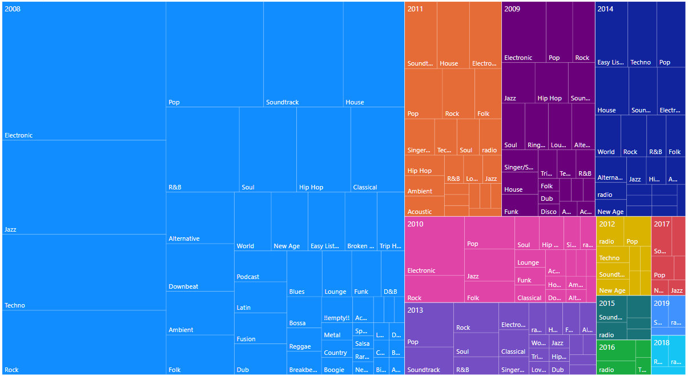

```{r}
library(readxl)
library(dplyr)

mydata = read_excel("C:/user/document/Temple University/DTA101/week05/itunes.xlsx", sheet = "cleaned")
myyear = format(as.Date(mydata$`date added`),"%Y")
mydata = cbind(mydata, myyear)

num_genre = length(unique(mydata$genre))
num_artist = length(unique(mydata$artist))
num_album = length(unique(mydata$`album name`))
num_song = length(unique(mydata$`song name`))
```

# Summary
genre: `r num_genre`  
artist: `r num_artist`  
album: `r num_album`  
song: `r num_song`  

# Tendency
```{r}
tempdata1 = data.frame(year = mydata$myyear, album = mydata$`album name`)
albumdata = tempdata1 %>% group_by(year) %>% summarise(album = length(unique(album)))
barplot(albumdata$album, names.arg = albumdata$year, main = 'imported album/year')
```



# Most played genre
```{r}
mygenre = data.frame(genre = mydata$genre, plays = mydata$plays)
mygenre = mygenre %>% group_by(genre) %>% summarise(plays = sum(plays))
mygenre = mygenre[order(mygenre$plays, decreasing = TRUE),]
head(mygenre, 10)
```
# Most played artist
```{r}
myartist = data.frame(artist = mydata$artist, plays = mydata$plays)
myartist = myartist %>% group_by(artist) %>% summarise(plays = sum(plays))
myartist = myartist[order(myartist$plays, decreasing = TRUE),]
head(myartist, 10)
```

# Most played album
```{r}
myalbum = data.frame(album = mydata$`album name`, plays = mydata$plays)
myalbum = myalbum %>% group_by(album) %>% summarise(plays = sum(plays))
myalbum = myalbum[order(myalbum$plays, decreasing = TRUE),]
head(myalbum, 10)
```

# Most played song
```{r}
mysong = data.frame(song = mydata$`song name`, plays = mydata$plays)
mysong = mysong %>% group_by(song) %>% summarise(plays = sum(plays))
mysong = mysong[order(mysong$plays, decreasing = TRUE),]
head(mysong, 10)
```
